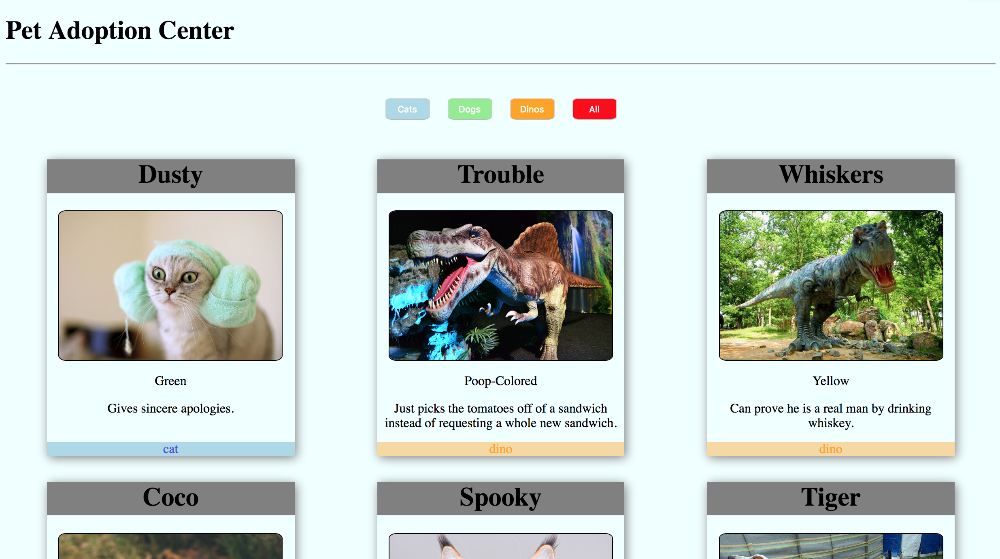
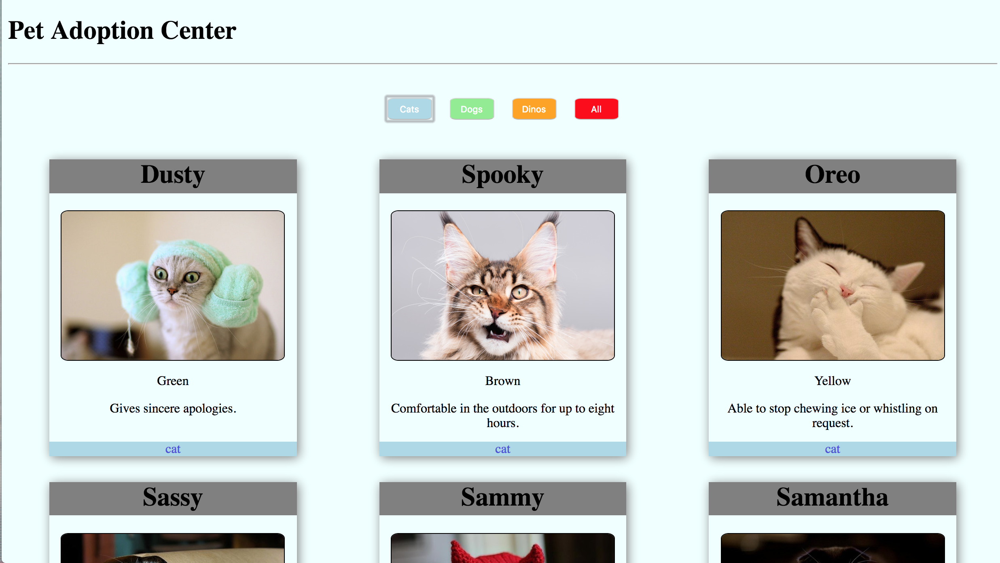
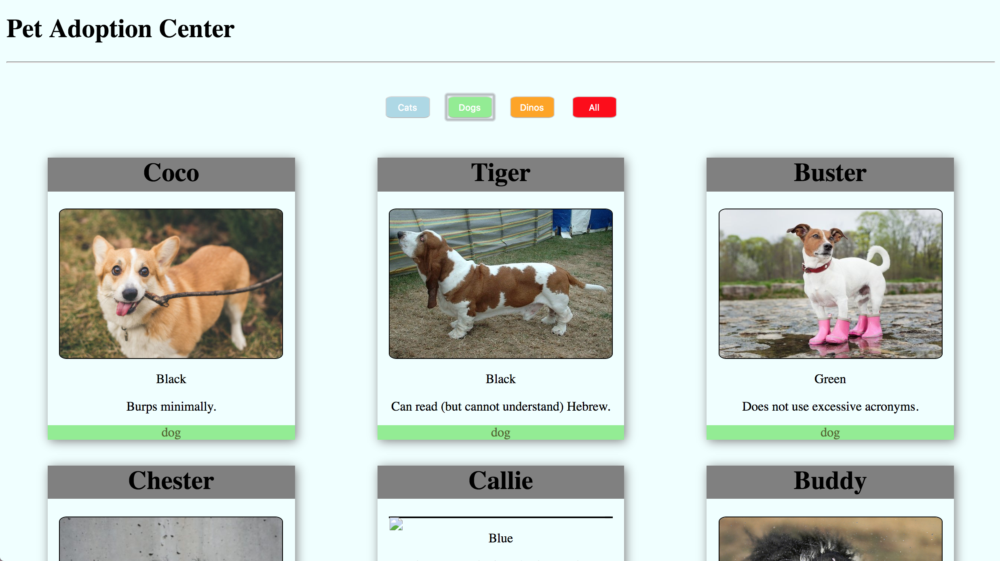
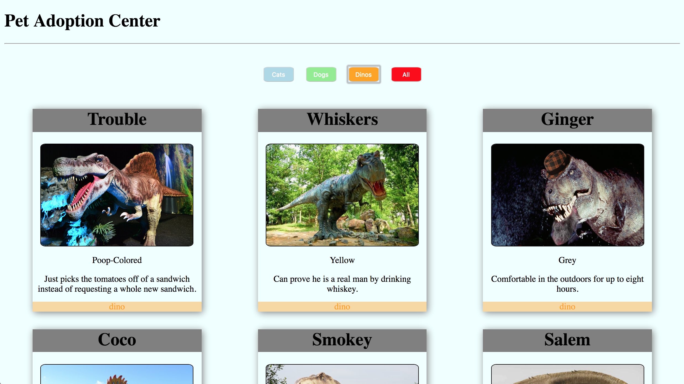

# Adoption Website

### Description
##### A page with three categories of animals shown that you can filter thru with the touch of a corresponding button or you can unfilter completely to view all animals with an All Pets button

Here is the loadscreen:

Here is it sorted by cats only:

Here it is sorted by dogs only:

Here it is sorted by dinos only:

### Tech Used:
* HTML5
* CSS
* JavaScript

### How to run:

1. Go to: `https://www.npmjs.com/package/http-server` and install "http-server".  
2. Navigate to the project folder in command line interface and type: `http-server -p 8080`  
3. This will show at: `http://localhost:8080` in your internet browser.  
